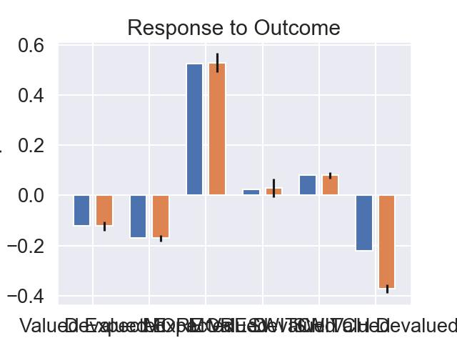

# README

Install Python and make sure that the `python` command can be ran from your command line.

Install require python packages with:
```bash
pip install seaborn pandas matplotlib numpy scipy
```

Then run 
```bash
python sea_salt_experiment.py
```
to produce:


Run 
```bash
python papageorgiou_results.py
``` 
to produce:




Code for experiments and figures in "Reward Bases: Instanteous Reward Revaluation with Temporal Difference Learning". Paper can be found here: https://www.biorxiv.org/content/biorxiv/early/2022/04/14/2022.04.14.488361.full.pdf

The ``sea_salt_experiment.py`` file contains the scripts to reproduce the Berridge experiment scripts.

The ``papageorgiou results.py`` script reproduces the panels of Figure 6 in the paper (based on the experiments of Papageorgiou et al)

The ``room_task_experiments.py`` script reproduces the panels of Figure 7 on the room task.

The files ``envs.py`` contains the environment classes for the various experiments and the ``learners.py`` file contains the classes for the reward basis, temporal difference, and successor representation agent
